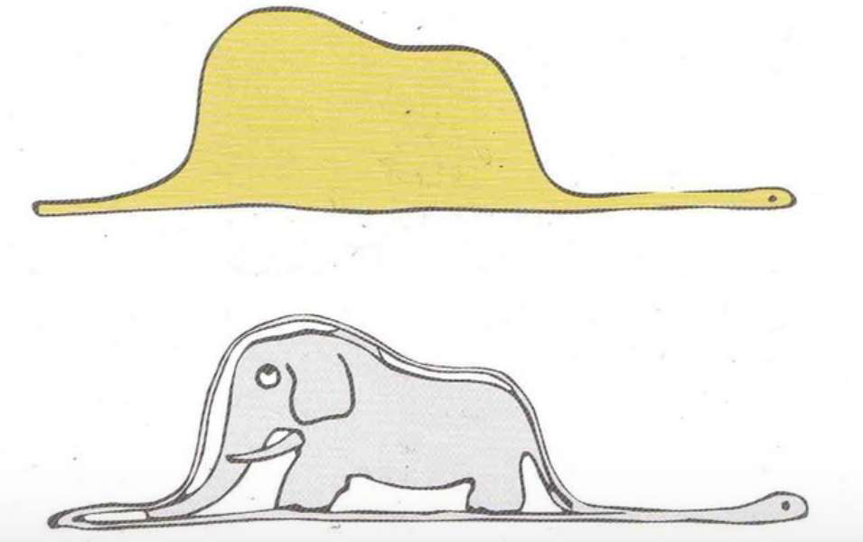

<!-- get the required files from 3rd party sources -->
<link href='http://fonts.googleapis.com/css?family=Roboto' rel='stylesheet' type='text/css'> <!-- use the font -->

```{=html}
<style>
  body {
    font-family: 'Roboto', sans-serif;
  }
</style>
```
\newpage

```{r setup, include=FALSE}
knitr::opts_chunk$set(echo = TRUE)
library(stringr)
```

# Problema 1:

> Pretende-se gerar 1000 números pseudo-aleatórios de uma variável aleatória com distribuição Binomial(n=6, p=0,5) pela soma de distribuições de Bernoulli. 
>
> Explique que método de geração de NPA utilizou e implemente o algoritmo em R. 
>
> Compare a proporção dos valores gerados com a distribuição teórica e interprete os resultados.


Usamos o método de transformação inversa para um exemplo discreto, para simular uma Bernoulli a partir de uma v.a. uniforme discreta entre 0 e 1 - $U[0,1]$. Seguidamente aplicamos uma convolução, somando 6 Bernoulli $ B(1, 0.5 )$, já que a Binomial com n=6 corresponde a uma soma de 6 Bernoulli.

```{r cars}
k <- 1000 # Nº de v.a. em cada amostra
n <- 6    # Nº de distribuições Bernoulli
p <- 0.5  # Probabilidade

x <- matrix(as.integer(runif(k*n) > p), nrow = k, ncol=n)
y <- rowSums(x)
# medidas:
# mean(y)
# var(y)
# sd(y)
# hist(y, probability = T)

# escala gráficos
x.g <- c(0:n)

par(mfrow =c(1,1))

plot(prop.table(table(y)), xlab = "x", ylab = "P(X)", lwd=8)
points(dbinom(x.g, size=n, prob = p) ~ x.g, type = "h", col = 2, lwd = 2)
legend("topright", legend = c("Empírico", "Teórico"), lty = 1, col = c(1, 2))

plot(ecdf(y), main="fdp B(6, 0.5)")
lines(pbinom(x.g, size=n, prob=p)  ~ x.g, type = "s", col="red")
legend("bottomright", legend = c("Empírico", "Teórico"), lty = 1, col = c(1, 2))

# Medidas teóricas da distribuição:
# avg=np  S^2=npq S=sqrt(npq) 
# Onde p é a probabilidade de sucesso e q = 1 - p.

```

Comparação:

| Medida              |Distribuição v.a. B(6,0.5)  | Distribuição teórica      |
|---------------------|----------------------------|---------------------------|
| média ($\bar{X}$)   | `r mean(y)`                | `r n*p`                   |
| variância ($S^2$)   | `r var(y)`                 | `r n*p*p`                 |
| desvio padrão ($S$) | `r round(sd(y), 2)`        | `r round(sqrt(n*p*p), 2)` |

TO DO: testes de qualidade?

# Problema 2:

> Pretende-se gerar 10000 números pseudo-aleatórios (NPA) de uma mistura semelhante à ilustração
do “Elefante dentro da Jibóia” do Principezinho de Saint-Exupéry.
>
> 

> Explique o método de geração de NPA e implemente o algoritmo em R.
> 
> Compare a distribuição empírica dos valores gerados com a distribuição teórica e interprete os
resultados.

```{r}
# TODO: desvio padrão tem de ser igual nas duas distribuições?
# TODO: limpar comentários

elephant_in_boa_mixture <- function(mu_a, mu_b, desv_pad = 1, p_a = 1/2, p_b = 1/2, n = 1000, xx_min = -6, xx_max = 6) {
    set.seed(444)
    
    mu <- c(mu_a, mu_b) # parâmetro mu de cada normal
    # "peso" de cada distribuição: p_a, p_b
    k <- sample(1:2, size=n, replace=TRUE, prob=c(p_a, p_b))
    m <- mu[k] # vector dim=n (mu_k1,...,mu_kn), elementos mu[1]=0 ou mu[2]=3
    x <- rnorm(n, m, desv_pad) 
    
    par(mfrow = c(2, 1))
    # plot da densidade da mistura dos NPA
    plot(density(x), xlim = c(xx_min, xx_max), ylim = c(0, .5),
    lwd = 3, xlab="x", main="", col = "grey20")
    text(1.9, 0.05, str_glue("{n} NPA mistura"),col="grey20")

    # fdp N(0,1)e N(3,1)
    for (i in 1:2)
        lines(density(rnorm(n, mu[i], desv_pad)),lty=2)
    text(-2.5,.3, str_glue("fdp N({mu_a}, {desv_pad})"))
    text(4.5,.3, str_glue("fdp N({mu_b}, {desv_pad})"))
    # fx=1/3 N(0,1) + 2/3 N(3,1)
    t <- seq(xx_min, xx_max, by = 0.1)
    lines(t, p_a * dnorm(t, mu_a, desv_pad) + p_b * dnorm(t, mu_b, desv_pad), lwd = 1, col = "red")
    text(0,.45, str_glue('fdp mistura fx = {p_a} N({mu_a}, {desv_pad}) + {p_b} N({mu_b}, {desv_pad})'), col="red")

    # HISTOGRAMA DOS NPA MISTURA 1/3 N(0,1) + 2/3 N(3,1)
    hist(x, prob = TRUE, main = NULL, ylim = c(0, 0.4), col = "grey20")
    text(0,0.38, " HISTOGRAMA")
    text(0,0.32,str_glue("{n} NPA mistura {p_a} N({mu_a}, {desv_pad}) + {p_b} N({mu_b}, {desv_pad})"))
}

elephant_in_boa_mixture(mu_a = 0, mu_b = 3)
elephant_in_boa_mixture(mu_a = 0, mu_b = 3, p_a = 0.6, p_b = 0.4, xx_max = 9)

```

