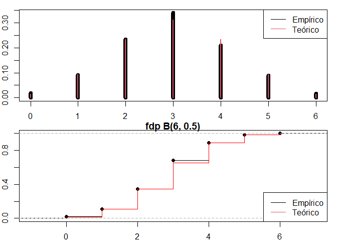
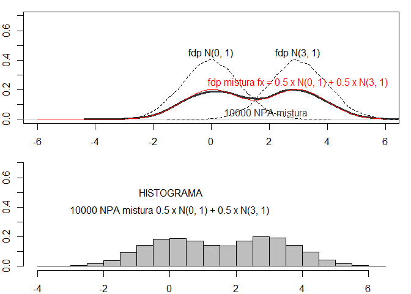
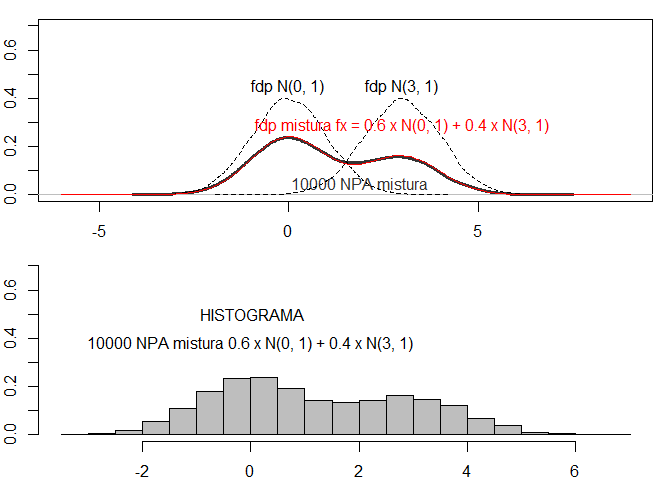
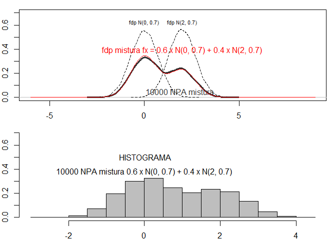

<!-- get the required files from 3rd party sources -->
<link href='http://fonts.googleapis.com/css?family=Roboto' rel='stylesheet' type='text/css'> <!-- use the font -->

```{=html}
<style>
  body {
    font-family: 'Roboto', sans-serif;
  }
</style>
```
\newpage


# Problema 1:

> Pretende-se gerar 1000 números pseudo-aleatórios de uma variável aleatória com distribuição Binomial(n=6, p=0,5) pela soma de distribuições de Bernoulli. 
>
> Explique que método de geração de NPA utilizou e implemente o algoritmo em R. 
>
> Compare a proporção dos valores gerados com a distribuição teórica e interprete os resultados.


Usamos o método de transformação inversa para um exemplo discreto, para simular uma distribuição Binomial. Para isto partirmos de 6 amostras de distribuições de Bernoulli. Começamos com a geração de NPA com distribuição uniforme entre 0 e 1 - $U[0,1]$ - e aplicamos o método da transformação inversa. Seguidamente aplicamos uma convolução, somando as 6 Bernoulli $B(1, 0.5)$, já que a Binomial com n=6 corresponde a uma soma de 6 Bernoulli.

$$
\begin{split}
X_1 \cap B(n=1, p=0.5) \\
X_2 \cap B(n=1, p=0.5) \\
... \\
X_6 \cap B(n=1, p=0.5) \\
S = X_1 + X_2 + ... + X_6 \cap B(n=6, p=0.5)
\end{split}
$$


```r
set.seed(444)


k <- 1000 # Nº de observações em cada amostra
n <- 6    # Nº de distribuições Bernoulli
p <- 0.5  # Probabilidade de sucesso

x <- matrix(as.integer(runif(k*n) > p), nrow = k, ncol=n)
y <- rowSums(x)

# escala gráficos
x.g <- c(0:n)

par(mfrow = c(2, 1),mar=c(2,2,1,1))

# gráfico distribuição empírica
plot(prop.table(table(y)), xlab = "x", ylab = "P[X]", lwd=8)
# gráfico distribuição teórica
points(dbinom(x.g, size=n, prob = p) ~ x.g, type = "h", col = 2, lwd = 2)
legend("topright", legend = c("Empírico", "Teórico"), lty = 1, col = c(1, 2))

# Função de distribuição empírica
plot(ecdf(y), main="fdp B(6, 0.5)")
# Função de distribuição teórica
lines(pbinom(x.g, size=n, prob=p)  ~ x.g, type = "s", col="red")
legend("bottomright", legend = c("Empírico", "Teórico"), lty = 1, col = c(1, 2))
```

<!-- -->

```r
# Medidas teóricas da distribuição:
# avg=np  S^2=npq S=sqrt(npq) 
# Onde p é a probabilidade de sucesso e q = 1 - p.
```

Comparação:

| Medida        |Distribuição     B(6, 0.5)         | Distribuição teórica                     |
|---------------|-----------------------------------|------------------------------------------|
| Média         | $\bar{X}$ = 2.97 | $\mu$ = 3                          |
| Variância     | $S^2$ = 1.49      | $\sigma^2$ = 1.5               |
| Desvio Padrão | $S$ = 1.22         | $\sigma$ = 1.22 |

Podemos observar graficamente que a distribuição obtida segue de muito perto a distribuição teórica.

Também confirmamos que as estatísticas da amostra se aproximam muito dos parâmetros da distribuição teórica.


# Problema 2:

> Pretende-se gerar 10000 números pseudo-aleatórios (NPA) de uma mistura semelhante à ilustração
do “Elefante dentro da Jibóia” do Principezinho de Saint-Exupéry.
>
> 

> Explique o método de geração de NPA e implemente o algoritmo em R.
> 
> Compare a distribuição empírica dos valores gerados com a distribuição teórica e interprete os
resultados.

Vamos usar uma mistura de duas Normais, de maneira a ter uma que crie a região da cabeça do elefante e outra que ajude a criar o dorso do elefante.


```r
elephant_in_boa_mixture <- function(mu_a, mu_b, 
                            desv_pad = 1, p_a = 1/2, p_b = 1/2, 
                            n = 10000, xx_min = -6, xx_max = 6) {
    
    mu <- c(mu_a, mu_b) # parâmetro mu de cada normal
    # "peso" de cada distribuição: p_a, p_b
    k <- sample(1:2, size=n, replace=TRUE, prob=c(p_a, p_b))
    m <- mu[k] # vector dim=n (mu_k1,...,mu_kn), elementos mu[1]=0 ou mu[2]=3
    x <- rnorm(n, m, desv_pad) 
    
    par(mfrow = c(2, 1),mar=c(2,2,1,1))
    # plot da densidade da mistura dos NPA
    plot(density(x), xlim = c(xx_min, xx_max), ylim = c(0, .7),
    lwd = 3, xlab="x", main="", col = "grey20")
    text(1.9, 0.05, str_glue("{n} NPA mistura"),col="grey20")

    # fdp de cada normal
    for (i in 1:2) {
      lines(density(rnorm(n, mu[i], desv_pad)),lty=2)
      txt <- str_glue("fdp N({mu[i]}, {desv_pad})")
      text(mu[i], dnorm(mu[i], mu[i], desv_pad)+0.05, txt, cex=abs(mu_b-mu_a)/3)
    }
    # text(4.7,.3, str_glue("fdp N({mu_b}, {desv_pad})"))
    
    # curva distribuição mistura teórica
    # fx = p_a N(mu_a, desv_pad) + p_b N(mu_n, desv_pad)
    t <- seq(xx_min, xx_max, by = 0.1)
    lines(t, p_a * dnorm(t, mu_a, desv_pad) + p_b * dnorm(t, mu_b, desv_pad), 
          lwd = 1, col = "red")
    txt <- str_glue('fdp mistura fx = {p_a} x N({mu_a}, {desv_pad}) + {p_b} x N({mu_b}, {desv_pad})')
    text(mu_b-mu_a, 
         max(dnorm(mu_a, mu_a, desv_pad)*p_a, dnorm(mu_b, mu_b, desv_pad)*p_b)+0.05, 
         txt, 
         col="red")

    # HISTOGRAMA DOS NPA MISTURA
    hist(x, prob = TRUE, main = NULL, ylim = c(0, 0.7), col = "grey")
    text(0,0.50, " HISTOGRAMA")
    text(0,0.38, 
     str_glue("{n} NPA mistura {p_a} x N({mu_a}, {desv_pad}) + {p_b} x N({mu_b}, {desv_pad})"))
    
}
```

Começamos por gerar uma mistura de duas normais com proporções iguais, experimentando com médias de 0 e 3, respetivamente:

```r
elephant_in_boa_mixture(mu_a = 0, mu_b = 3)
```

<!-- -->


Verificamos que a primeira curva normal deveria ter um peso superior, por isso editamos o parâmetro respetivo, dando um peso de 0.6  à curva da "cabeça do elefante":

```r
elephant_in_boa_mixture(mu_a = 0, mu_b = 3, p_a = 0.6, p_b = 0.4, xx_max = 9)
```

<!-- -->

Verificamos que a curva anterior não está semelhante à da imagem, por isso:

 1. aproximamos a média da segunda normal à primeira, com o objectivo de aproximar o cume que representa o dorso ao que representa a cabeça do elefante;
 
 2. diminuímos o achatamento das curvas, diminuindo o desvio padrão para 0.7.
 

```r
elephant_in_boa_mixture(mu_a = 0, mu_b = 2, desv_pad = 0.7, 
                        p_a = 0.6, p_b = 0.4, xx_max = 9)
```

<!-- -->

Podemos observar que as densidades obtidas seguem a densidade teórica. Por outro lado, manipulando as duas médias foi possível definir o afastamento entre os dois cumes, ao mesmo tempo que manipulando os "pesos" da mistura conseguimos controlar a altura de cada um dos cumes.


